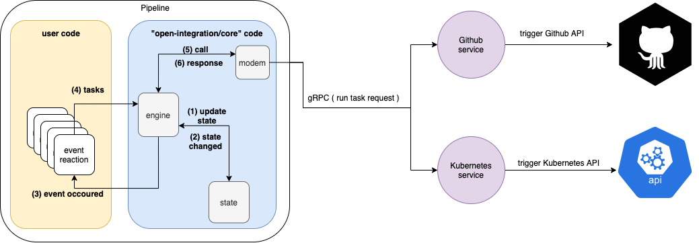

# Open Integration - a pipeline execution engine

Til the project has not reached `version > 1.x.x` it may have breaking changes in the API, please use the latest version before opening issue.

## Concepts
* A compiled, binray pipeline
* State - the engine holds the state of all the tasks
* Service - a standalone binary exposing API over http2 (gRPC) that the engine can trigger, called endpoint.
	* Endpoint of a service defined by 2 files of JSON schema, `arguments.json` and `returns.json`, the engine will enforce the arguments given by a task and the output created to match the schema.
* Task - execution flow with input and output.
	* Service Task will send a request to service based on the endpoint.

## Architecture

## Dataflow

### Example
use oictl to generate hello-world pipeline
* `ioctl generate pipeline`
* `go run *.go`

### Real world examples
* [JIRA](https://github.com/olegsu/jira-sync)
* [Trello](https://github.com/olegsu/trello-sync)
* [open-integration/core-ci-pipeline](https://github.com/open-integration/core-ci-pipeline)
